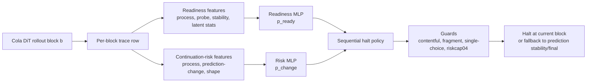

# Safe Adaptive Halting for Block-wise Cola Rollouts

Paper-style internal report. Last updated: 2026-05-25.

## Abstract

This report summarizes the current evidence for safe adaptive halting in the
official Cola 8-task block-wise rollout protocol. The key result is not an
official benchmark accuracy improvement. The replicated result is that a
non-gold halt policy can reduce the number of generated latent blocks while
matching the conservative prediction-stability baseline under leave-one-task-out
transfer.

Across the full prepared split with three trace seeds, the current best policy,
`joint-readiness + prediction-change risk + riskcap04 + shape/stability guards`,
matches prediction-stability weighted micro accuracy at `21.596% +/- 0.030%`
while reducing average block use from `2.512/4` to `2.118/4`. It has `0`
observed losses versus both fixed-final and prediction-stability across the
three seeds. The strongest negative result is equally important: removing
`riskcap04` and relying on a 38-feature answer-shape risk model plus fragment
guards gives similar aggregate accuracy at `2.153/4` blocks, but this hides
`19` losses and `19` gains versus prediction-stability. Therefore the no-riskcap
shape model is a diagnostic, not a safe replacement.

## Main Claims

| Claim | Evidence | Interpretation |
|---|---:|---|
| The main safety-cost point is joint readiness plus prediction-change risk with `riskcap04`. | `21.596% +/- 0.030%`, `2.118 +/- 0.010/4` blocks, `0` losses vs prediction-stability. | This is the current baseline for cross-task transfer. |
| Prediction stability is a strong non-gold baseline. | `21.596% +/- 0.029%`, `2.512/4` blocks. | Any learned halt policy must beat this cost without losing samples. |
| Prediction-change risk transfers but barely saves beyond stability by itself. | `21.596% +/- 0.029%`, `2.499/4`, `0` losses. | Risk alone detects change risk but still halts close to stability. |
| Joint readiness is what moves the frontier left. | `2.499/4` to `2.118/4` at the same observed safety level. | Readiness thresholding supplies useful pre-stability decisions when capped. |
| 38-feature no-riskcap is not safe despite good aggregate accuracy. | `2.153/4`, `19` losses and `19` gains vs prediction-stability. | Aggregate accuracy is loss/gain cancellation. |
| Post-hoc no-riskcap zero-loss frontier does not beat riskcap04. | `2.191/4` blocks, zero observed losses only after post-hoc selection. | More answer-shape features help diagnosis but do not replace riskcap. |
| Fragment-completeness v3 restores safety only with higher cost. | `2.245/4`, `0` losses. | Current hand-written shape guards are too broad or too incomplete. |

## Figure 1: Safety-Cost Frontier


Figure source:
`/data1/luyifei/drla/scripts/make_paper_figures.py`

Data source:
`/data1/luyifei/drla/outputs/paper_report_20260525/figure_data.json`

## Problem Setting

The system evaluates adaptive halting for official Cola block-wise rollouts.
Each sample is generated for up to `4` latent blocks under a `64` token budget.
The offline trace records per-block decoder outputs, model confidence probes,
latent statistics, task-scored predictions, and final correctness. At real
inference time the halt policy must be online: at block `b`, it may only use
features from block `b` and earlier blocks. It cannot inspect future blocks.

The current experiments are offline replay over precomputed traces. This is
valid for counterfactual halt evaluation because the policy scans blocks in
order and only uses current/past features, but deployment still requires
integrating the policy into the online generation loop.

The main full prepared split contains:

- `8` tasks: LAMBADA, MMLU, OBQA, HellaSwag, RACE, SIQA, SQuAD, StoryCloze.
- `49,019` samples per seed.
- `196,076` trace rows per seed, because each sample has `4` block rows.
- `3` trace/frontier seeds: seed66, seed67, seed68.

Important metric distinction:

- Official scorer task-average across the three full-split traces is
  `25.070% +/- 0.165%`.
- Halt summaries usually report weighted micro accuracy over replay/eval
  splits. The cross-task held-out `split=all` weighted micro fixed-final
  accuracy is about `21.593%`.

These are different aggregations and should not be mixed as if they were the
same benchmark number.

## Method

### Data Flow



### Readiness Model

The readiness model is a trainable MLP with two input branches:

- latent branch: normalized latent vector to hidden features.
- feature branch: normalized process/probe/stability features plus optional
  task one-hot.

The two branches are concatenated and passed to three heads:

- `readiness_logits`: whether the current block is at or after the oracle
  readiness frontier.
- `correctness_logits`: auxiliary prediction of current correctness.
- `future_gain`: auxiliary regression target for future correctness gain.

The halt policy uses only `sigmoid(readiness_logits)` as `p_ready`. The current
cross-task protocol uses `process_no_task`, so raw latent vectors and task
one-hot are zeroed. This keeps the transfer setting task-agnostic and makes the
readiness decision rely on non-gold process/probe/stability signals.

The 27 readiness features cover:

- block position: `block_number`, `max_block_budget`.
- latent dynamics: latent norm, latent delta, cosine to previous latent, denoise
  drift, plus missingness indicators.
- decoder confidence and stop probes: entropy, top probability, EOS/im_end/stop
  probabilities and stop-token margins.
- text and scoring stability: non-empty answer flags, answer changes, same-text
  streaks, scored-prediction changes/streaks, processed-generation
  changes/streaks.
- stop flags: already stopped, contains EOS, contains im_end, contains stop.

### Continuation-Risk Model

The continuation-risk model is a second trainable MLP. It does not estimate
gold correctness. It predicts whether the current task-scored prediction is
likely to change before the rollout reaches the prediction-stability reference.

Current target:

```text
y_risk = 1 if current scored_prediction != prediction_stability_reference
         0 otherwise
```

The prediction-stability reference is the first non-empty task-scored prediction
that repeats for two consecutive blocks; if no such point exists, it falls back
to the final block prediction.

The 38 risk features include:

- block position: block number, max budget, remaining blocks, block fraction.
- decoder confidence and stop probes.
- scored-prediction and processed-generation stability features.
- answer-shape features: character length, word count, terminal punctuation,
  mid-token punctuation, numeric-ish flags, decimal prefixes, single-letter
  period suffixes, unbalanced quote/bracket flags, last-token length, short
  last-token flag, processed length, decoded length.

### Halt Policy

The halt policy is not another trainable network. It is a calibrated sequential
decision rule over the two MLP probabilities plus guards:

```text
for block in 1..4:
    compute p_ready and p_change from current row features
    if p_ready >= readiness_threshold:
        blocked = p_change >= risk_threshold
        blocked |= not contentful(scored_prediction)
        blocked |= incomplete_fragment(scored_prediction)
        blocked |= unstable_single_choice_when_guarded
        if not blocked:
            halt at current block
    if prediction_stability_reached:
        halt at current block
halt at final block
```

`riskcap04` is a calibration restriction, not a model. It limits selected risk
thresholds to at most `0.4`, preventing validation from accepting very high
thresholds such as `0.9` that look cheap but allow prefix/completion failures on
held-out tasks.

## Experimental Protocol

The primary protocol is leave-one-task-out transfer:

1. Train readiness and risk models on 7 tasks.
2. Calibrate thresholds on the 7-task validation split.
3. Evaluate the held-out task on `split=all`.
4. Aggregate held-out task results across all 8 tasks.
5. Repeat for seed66, seed67, seed68.

The key validation constraints for the current baseline are:

- risk target: `prediction_change`.
- readiness threshold sweep:
  `0.0,0.1,0.2,0.3,0.4,0.5,0.6,0.65,0.7,0.75,0.8`.
- risk threshold selection: `min_blocks`.
- `risk_threshold_end=0.4`.
- `require_zero_calibration_loss=true`.
- contentful prediction guard.
- block2 single-choice stability guard.

## Main Results

| Policy | Accuracy | Avg blocks | Saving vs final | Saving vs stability | Losses vs stability |
|---|---:|---:|---:|---:|---:|
| Fixed final | `21.593% +/- 0.029%` | `4.000/4` | `0.000` | n/a | n/a |
| Prediction stability | `21.596% +/- 0.029%` | `2.512/4` | `1.488` | `0.000` | `0` |
| Prediction-change risk | `21.596% +/- 0.029%` | `2.499/4` | `1.501` | `0.013` | `0` |
| Joint readiness + riskcap04 | `21.596% +/- 0.030%` | `2.118/4` | `1.882` | `0.394` | `0` |
| 38-feature no-riskcap v2 | `21.596% +/- 0.031%` | `2.153/4` | `1.847` | `0.358` | `19` |
| 38-feature v3 + riskcap04 | `21.596% +/- 0.029%` | `2.245/4` | `1.755` | `0.267` | `0` |

The central conclusion is that the current best policy is not the most complex
shape-feature model. It is the risk-capped joint readiness policy. The no-riskcap
shape-feature model is cheaper than prediction-stability, but its aggregate
accuracy is not safe evidence because loss/gain cancellation exactly masks
sample-level failures.

## Figure 2: Seed-Level Cost Consistency


The cost reduction from joint readiness plus `riskcap04` is replicated across
all three trace seeds. Seed68 is slightly cheaper than seed66/seed67, but the
main effect is stable: the policy consistently moves below both
prediction-stability and the no-riskcap 38-feature policy while preserving zero
observed losses.

## Negative Result: No-Riskcap Shape Features

The 38-feature risk model has high risk AUROC on the prediction-change target
and its answer-shape features are useful for diagnosis. However, they are not
yet a safe replacement for `riskcap04`.

Observed held-out losses versus prediction-stability:

- seed66: SQuAD `7`.
- seed67: HellaSwag `2`, SQuAD `6`.
- seed68: HellaSwag `1`, StoryCloze `3`.

Representative failure modes include:

- `AS-` versus `AS-205`.
- `Metro:` versus `Metro: All Change`.
- `$20` versus `$20 billion`.
- `Laverne &` versus `Laverne & Shirley`.
- HellaSwag `[substeps]` or `[step]` fragments before the answer action appears.


This failure surface matters because it is not solved by multiple-choice
stability guards alone. It is a free-text completion/readiness problem.

## Interpretation

The evidence supports four careful claims:

1. Non-gold stability signals are already strong. Prediction-stability is a
   hard baseline because it preserves accuracy while saving nearly half the
   fixed-final block budget.
2. A learned prediction-change risk model can transfer across tasks with zero
   observed losses, but by itself it halts only marginally earlier than
   prediction-stability.
3. A readiness model adds useful pre-stability decisions, but only when coupled
   to conservative calibration and safety caps.
4. More answer-shape features are useful for understanding failures, but current
   hand-written shape guards do not replace risk calibration.

The main paper story should therefore be:

```text
Safe adaptive halting is possible in offline Cola block replay, but only when
readiness, prediction-change risk, and conservative non-gold guards are treated
as a calibrated decision system rather than as a single learned classifier.
```

## Limitations

- This is offline replay, not yet online generation integration.
- The three seeds are trace/frontier variants over the same prepared full split,
  so they support replication but not broad population-level statistical claims.
- Weighted micro halt accuracy should not be described as the official Cola
  task-average benchmark score.
- No-riskcap policies can hide failures through loss/gain cancellation.
- The current risk and readiness models are MLPs over engineered features, not a
  learned sequence-level completion model.
- Related work and citations are not included here because citations should be
  fetched and verified programmatically before a paper draft uses them.

## Paper Draft Framing

Working title:

```text
Safe Adaptive Halting for Latent Diffusion Language Model Rollouts
```

Possible abstract claim:

```text
We study whether block-wise latent diffusion language model rollouts can be
halted before the fixed generation budget without gold labels at inference time.
On the official Cola 8-task prepared split, a calibrated policy combining
task-agnostic readiness, prediction-change risk, and conservative shape/stability
guards matches prediction-stability accuracy across three full-split trace seeds
while reducing average block use from 2.512/4 to 2.118/4, with zero observed
losses versus prediction-stability. Ablations show that removing the risk cap
produces superficially similar aggregate accuracy but introduces 19 held-out
sample losses, concentrated in free-text prefix and completion failures.
```

Suggested section outline:

1. Introduction: latent-block generation has a fixed budget; task-scored answers
   often stabilize earlier; naive early halt fails on prefixes.
2. Problem: safe non-gold adaptive halting under online visibility constraints.
3. Method: readiness model, prediction-change risk model, calibration, guards.
4. Experiments: full prepared split, 8 tasks, 3 seeds, leave-one-task-out.
5. Results: safety-cost frontier and seed consistency.
6. Negative results: no-riskcap shape features and completion failures.
7. Discussion: what signals transfer, what still fails, online integration.

## Evidence Paths

Primary summaries:

- `/data1/luyifei/drla/outputs/cola_experiment_summaries/official8_full_b64_bs12_cross_task_joint_readiness_riskcap04_cross_seed_20260524/summary.json`
- `/data1/luyifei/drla/outputs/cola_experiment_summaries/official8_full_b64_bs12_cross_task_prediction_change_risk_cross_seed_20260524/summary.json`
- `/data1/luyifei/drla/outputs/cola_experiment_summaries/official8_full_b64_bs12_cross_task_shape_features_fragmentguardv2_choice2_noriskcap_cross_seed_20260524/summary.json`
- `/data1/luyifei/drla/outputs/cola_experiment_summaries/official8_full_b64_bs12_cross_task_shape_features_fragmentguardv3_choice2_riskcap04_cross_seed_20260524/summary.json`
- `/data1/luyifei/drla/outputs/cola_experiment_summaries/official8_full_b64_bs12_cross_seed_20260524/summary.json`

Code paths:

- `/data1/luyifei/drla/drla/scripts/train_cola_readiness_model.py`
- `/data1/luyifei/drla/drla/scripts/train_cola_continuation_risk_model.py`
- `/data1/luyifei/drla/drla/scripts/eval_cola_risk_gated_halt.py`
- `/data1/luyifei/drla/scripts/make_paper_figures.py`

Generated paper-report artifacts:

- `/data1/luyifei/drla/outputs/paper_report_20260525/figure_data.json`
- `/data1/luyifei/drla/outputs/paper_report_20260525/figures/fig_cross_task_tradeoff.pdf`
- `/data1/luyifei/drla/outputs/paper_report_20260525/figures/fig_seed_block_costs.pdf`
- `/data1/luyifei/drla/outputs/paper_report_20260525/figures/fig_no_riskcap_loss_breakdown.pdf`
