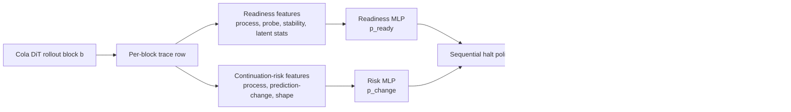

# 面向 Cola 分块生成的安全自适应早停

> 状态：论文/报告草稿。本文是 P0 adaptive halt / riskcap04 的中文 canonical paper-style report。

论文式内部报告。最后更新：2026-05-25。

## 摘要

这份报告梳理当前关于 official Cola 8-task 分块 rollout 协议中安全自适应早停的证据。这里最重要的结论不是“提升了 official benchmark accuracy”，而是：在不使用推理时 gold label 的前提下，一个非 gold 的早停策略可以在保持保守 `prediction_stability` 基线准确率的同时，减少需要生成的 latent block 数量，并且这个结果在 leave-one-task-out 迁移设置下可复现。

在 full prepared split 的三个 trace seed 上，当前最好的策略是 `joint-readiness + prediction-change risk + riskcap04 + shape/stability guards`。它达到与 `prediction_stability` 相同量级的 weighted micro accuracy：`21.596% +/- 0.030%`，同时把平均 block 使用量从 `2.512/4` 降到 `2.118/4`。在三个 seed 合计上，它相对 fixed-final 和 prediction-stability 都有 `0` 个 observed losses。

同样重要的是一个负结果：如果移除 `riskcap04`，只依赖 38-feature answer-shape risk model 加 fragment guards，表面 aggregate accuracy 仍然接近，并且平均 block 是 `2.153/4`，但这其实隐藏了相对 prediction-stability 的 `19` 个 losses 和 `19` 个 gains。这是 loss/gain cancellation，不是安全结果。因此 no-riskcap shape model 当前只能作为诊断工具，不能替代 riskcap04。

## 核心结论

| 结论 | 证据 | 解释 |
|---|---:|---|
| 当前最好的安全-成本点是 joint readiness + prediction-change risk + `riskcap04`。 | `21.596% +/- 0.030%`，`2.118 +/- 0.010/4` blocks，`0` losses vs prediction-stability。 | 这是当前 cross-task transfer 的主 baseline。 |
| Prediction stability 是很强的非 gold 基线。 | `21.596% +/- 0.029%`，`2.512/4` blocks。 | 任何 learned halt policy 都必须在不丢样本的前提下比它更省。 |
| Prediction-change risk 可以迁移，但单独使用时只比 stability 略省。 | `21.596% +/- 0.029%`，`2.499/4`，`0` losses。 | Risk model 能识别 prediction-change 风险，但停止点仍接近 stability。 |
| Joint readiness 是把 frontier 往左推的关键。 | 在相同 observed safety 下，从 `2.499/4` 降到 `2.118/4`。 | Readiness thresholding 提供了有用的 pre-stability 决策，但需要 safety cap。 |
| 38-feature no-riskcap 虽然 aggregate accuracy 好看，但不安全。 | `2.153/4`，相对 prediction-stability 有 `19` losses 和 `19` gains。 | aggregate accuracy 被 loss/gain cancellation 掩盖。 |
| Post-hoc no-riskcap zero-loss frontier 仍然不优于 riskcap04。 | `2.191/4` blocks，且 zero-loss 是 post-hoc 选择得到的。 | answer-shape features 有诊断价值，但不能替代 riskcap。 |
| Fragment-completeness v3 只有在加回 riskcap04 后才恢复安全，但成本更高。 | `2.245/4`，`0` losses。 | 当前手写 shape guards 要么过宽，要么仍不完整。 |

## 图 1：安全-成本 frontier


图生成脚本：
`/data1/luyifei/drla/scripts/make_paper_figures.py`

图数据：
`/data1/luyifei/drla/outputs/paper_report_20260525/figure_data.json`

## 问题设定

我们评估的是 official Cola block-wise rollout 上的 adaptive halting。每个样本最多生成 `4` 个 latent blocks，总 token budget 为 `64`。离线 trace 记录了每个 block 的 decoder output、模型置信度 probe、latent statistics、task-scored prediction，以及最终 correctness。

真正推理时，早停策略必须是 online 的：在第 `b` 个 block，策略只能看到当前 block 和之前 block 的信息，不能偷看未来 block。当前实验是基于预先收集的 trace 做 offline replay；这适合做 counterfactual halt evaluation，因为策略是按 block 顺序扫描，并且每一步只使用 current/past features。但要真正部署，还需要把该策略接入 online generation loop。

当前主实验 full prepared split 包含：

- `8` 个任务：LAMBADA、MMLU、OBQA、HellaSwag、RACE、SIQA、SQuAD、StoryCloze。
- 每个 seed 有 `49,019` 个样本。
- 每个 seed 有 `196,076` 行 trace，因为每个样本有 `4` 个 block rows。
- `3` 个 trace/frontier seeds：seed66、seed67、seed68。

需要特别区分两个 accuracy 聚合口径：

- full-split 三个 trace 的 official scorer task-average 是 `25.070% +/- 0.165%`。
- halt summary 通常报告 replay/eval split 上的 weighted micro accuracy。cross-task held-out `split=all` 的 weighted micro fixed-final accuracy 约为 `21.593%`。

这两个指标不是同一个东西，不能混在一起写成 benchmark improvement。

## 方法

### 数据流



### Readiness Model

Readiness model 是一个可训练 MLP，有两个输入分支：

- latent branch：对归一化 latent vector 编码。
- feature branch：对归一化的 process/probe/stability features 编码，并可拼接 task one-hot。

两个分支 concat 后进入 joint MLP，并输出三个 heads：

- `readiness_logits`：当前 block 是否已经到达或超过 oracle readiness frontier。
- `correctness_logits`：辅助预测当前 block 是否正确。
- `future_gain`：辅助回归未来 correctness gain。

真正 halt policy 只使用 `sigmoid(readiness_logits)`，记为 `p_ready`。当前 cross-task 主协议使用 `process_no_task`，也就是 raw latent vectors 和 task one-hot 都被置零。因此这个迁移设置主要依赖非 gold 的 process/probe/stability signals，而不是任务 ID 或原始 latent 表示。

27 个 readiness features 覆盖：

- block 位置：`block_number`、`max_block_budget`。
- latent 动态：latent norm、latent delta、与前一 latent 的 cosine、denoise drift，以及 missingness indicators。
- decoder 置信度与 stop probes：entropy、top probability、EOS/im_end/stop probabilities、stop-token margins。
- 文本与 scoring stability：answer 是否为空、answer 是否变化、same-text streak、scored-prediction changes/streaks、processed-generation changes/streaks。
- stop flags：already stopped、contains EOS、contains im_end、contains stop。

### Continuation-Risk Model

Continuation-risk model 是第二个可训练 MLP。它不是 correctness predictor，也不预测 gold 正确性。它预测的是：当前 task-scored prediction 在到达 prediction-stability reference 前是否还会变化。

当前 target 是：

```text
y_risk = 1 if current scored_prediction != prediction_stability_reference
         0 otherwise
```

其中 prediction-stability reference 是第一个连续两个 block 都相同的非空 task-scored prediction；如果没有这样的稳定点，则退回 final block prediction。

38 个 risk features 包括：

- block 位置：block number、max budget、remaining blocks、block fraction。
- decoder confidence 和 stop probes。
- scored-prediction 与 processed-generation stability features。
- answer-shape features：字符长度、词数、terminal punctuation、mid-token punctuation、numeric-ish flags、decimal prefixes、single-letter period suffixes、unbalanced quote/bracket flags、last-token length、short last-token flag、processed length、decoded length。

### Halt Policy

Halt policy 不是第三个 trainable network，而是一个经过 calibration 的 sequential decision rule。它使用两个 MLP 输出的概率，再叠加 guards：

```text
for block in 1..4:
    compute p_ready and p_change from current row features
    if p_ready >= readiness_threshold:
        blocked = p_change >= risk_threshold
        blocked |= not contentful(scored_prediction)
        blocked |= incomplete_fragment(scored_prediction)
        blocked |= unstable_single_choice_when_guarded
        if not blocked:
            halt at current block
    if prediction_stability_reached:
        halt at current block
halt at final block
```

`riskcap04` 不是模型，而是 calibration restriction。它把可选 risk threshold 限制在 `0.4` 以内，防止 validation 选择 `0.9` 这类看起来很省、但在 held-out task 上会放过 prefix/completion failure 的过高阈值。

## 实验协议

主协议是 leave-one-task-out transfer：

1. 在 7 个任务上训练 readiness 和 risk models。
2. 在这 7 个任务的 valid split 上 calibration thresholds。
3. 在 held-out task 的 `split=all` 上评估。
4. 对 8 个 held-out tasks 聚合结果。
5. 对 seed66、seed67、seed68 重复上述流程。

当前 baseline 的关键 calibration 约束是：

- risk target：`prediction_change`。
- readiness threshold sweep：
  `0.0,0.1,0.2,0.3,0.4,0.5,0.6,0.65,0.7,0.75,0.8`。
- risk threshold selection：`min_blocks`。
- `risk_threshold_end=0.4`。
- `require_zero_calibration_loss=true`。
- contentful prediction guard。
- block2 single-choice stability guard。

## 主要结果

| Policy | Accuracy | Avg blocks | Saving vs final | Saving vs stability | Losses vs stability |
|---|---:|---:|---:|---:|---:|
| Fixed final | `21.593% +/- 0.029%` | `4.000/4` | `0.000` | n/a | n/a |
| Prediction stability | `21.596% +/- 0.029%` | `2.512/4` | `1.488` | `0.000` | `0` |
| Prediction-change risk | `21.596% +/- 0.029%` | `2.499/4` | `1.501` | `0.013` | `0` |
| Joint readiness + riskcap04 | `21.596% +/- 0.030%` | `2.118/4` | `1.882` | `0.394` | `0` |
| 38-feature no-riskcap v2 | `21.596% +/- 0.031%` | `2.153/4` | `1.847` | `0.358` | `19` |
| 38-feature v3 + riskcap04 | `21.596% +/- 0.029%` | `2.245/4` | `1.755` | `0.267` | `0` |

中心结论是：当前最好的策略不是最复杂的 shape-feature model，而是 risk-capped joint readiness policy。no-riskcap shape-feature model 的平均 block 确实低于 prediction-stability，但它的 aggregate accuracy 不能作为安全证据，因为 sample-level losses 被 gains 精确抵消了。

## 图 2：Seed-level block cost


Joint readiness + `riskcap04` 的成本下降在三个 trace seed 上都复现了。seed68 略微更省，但主效应稳定：该策略始终低于 prediction-stability 和 no-riskcap 38-feature policy，同时保持 `0` observed losses。

## 负结果：No-riskcap shape features

38-feature risk model 在 prediction-change target 上有很高 AUROC，answer-shape features 对诊断也很有价值。但目前它们还不能安全替代 `riskcap04`。

相对 prediction-stability 的 held-out losses 分布如下：

- seed66：SQuAD `7`。
- seed67：HellaSwag `2`，SQuAD `6`。
- seed68：HellaSwag `1`，StoryCloze `3`。

典型失败包括：

- `AS-` vs `AS-205`。
- `Metro:` vs `Metro: All Change`。
- `$20` vs `$20 billion`。
- `Laverne &` vs `Laverne & Shirley`。
- HellaSwag 在答案动作生成前出现 `[substeps]` 或 `[step]` fragments。


这个 failure surface 很关键，因为它不是单靠 multiple-choice stability guards 就能解决的。它本质上是 free-text completion/readiness 问题。

## 解释

当前证据支持四个谨慎结论：

1. 非 gold stability signals 已经很强。Prediction-stability 是一个很难超越的基线，因为它在保持准确率的同时已经节省了接近一半 fixed-final block budget。
2. Learned prediction-change risk model 可以跨任务迁移，并且能做到 `0` observed losses，但单独使用时只比 prediction-stability 略微提前。
3. Readiness model 提供了有用的 pre-stability 决策，但必须和保守 calibration、安全 cap 一起使用。
4. 更多 answer-shape features 对理解 failure 很有帮助，但当前手写 shape guards 不能替代 risk calibration。

因此当前论文主线应该是：

```text
在离线 Cola block replay 中，安全自适应早停是可行的；
但前提是把 readiness、prediction-change risk 和保守的非 gold guards
作为一个经过 calibration 的 decision system，而不是单个 learned classifier。
```

## 局限

- 当前结果来自 offline replay，还不是 online generation integration。
- 三个 seeds 是同一个 prepared full split 上的 trace/frontier variants；它们能支持 replicated evidence，但不能支撑广义 population-level statistical claims。
- Weighted micro halt accuracy 不能被描述成 official Cola task-average benchmark score。
- No-riskcap policy 可能通过 loss/gain cancellation 掩盖失败。
- 当前 risk/readiness models 是基于 engineered features 的 MLP，还不是 sequence-level learned completion model。
- 这里暂时没有写 Related Work 和 citations，因为正式论文里的 citations 应该通过程序化检索和验证后再加入，不能凭记忆生成。

## 论文草稿 framing

工作标题：

```text
Safe Adaptive Halting for Latent Diffusion Language Model Rollouts
```

可用的中文摘要表述：

```text
我们研究 block-wise latent diffusion language model rollout 是否能在固定生成预算前、
且不使用推理时 gold labels 的条件下安全早停。在 official Cola 8-task prepared split 上，
一个结合 task-agnostic readiness、prediction-change risk 和保守 shape/stability guards
的 calibrated policy，在三个 full-split trace seeds 上匹配 prediction-stability accuracy，
同时把平均 block 使用量从 2.512/4 降到 2.118/4，并且相对 prediction-stability 有
0 个 observed losses。消融显示，移除 risk cap 会得到表面相近的 aggregate accuracy，
但引入 19 个 held-out sample losses，主要集中在 free-text prefix 和 completion failures。
```

建议 section outline：

1. Introduction：latent-block generation 有固定预算；task-scored answers 经常更早稳定；naive early halt 会在 prefix 上失败。
2. Problem：online visibility constraints 下的 safe non-gold adaptive halting。
3. Method：readiness model、prediction-change risk model、calibration、guards。
4. Experiments：full prepared split、8 tasks、3 seeds、leave-one-task-out。
5. Results：safety-cost frontier 和 seed consistency。
6. Negative results：no-riskcap shape features 与 completion failures。
7. Discussion：哪些信号能迁移，哪些问题仍失败，以及 online integration。

## 证据路径

Primary summaries：

- `/data1/luyifei/drla/outputs/cola_experiment_summaries/official8_full_b64_bs12_cross_task_joint_readiness_riskcap04_cross_seed_20260524/summary.json`
- `/data1/luyifei/drla/outputs/cola_experiment_summaries/official8_full_b64_bs12_cross_task_prediction_change_risk_cross_seed_20260524/summary.json`
- `/data1/luyifei/drla/outputs/cola_experiment_summaries/official8_full_b64_bs12_cross_task_shape_features_fragmentguardv2_choice2_noriskcap_cross_seed_20260524/summary.json`
- `/data1/luyifei/drla/outputs/cola_experiment_summaries/official8_full_b64_bs12_cross_task_shape_features_fragmentguardv3_choice2_riskcap04_cross_seed_20260524/summary.json`
- `/data1/luyifei/drla/outputs/cola_experiment_summaries/official8_full_b64_bs12_cross_seed_20260524/summary.json`

Code paths：

- `/data1/luyifei/drla/drla/scripts/train_cola_readiness_model.py`
- `/data1/luyifei/drla/drla/scripts/train_cola_continuation_risk_model.py`
- `/data1/luyifei/drla/drla/scripts/eval_cola_risk_gated_halt.py`
- `/data1/luyifei/drla/scripts/make_paper_figures.py`

Generated paper-report artifacts：

- `/data1/luyifei/drla/outputs/paper_report_20260525/figure_data.json`
- `/data1/luyifei/drla/outputs/paper_report_20260525/figures/fig_cross_task_tradeoff.pdf`
- `/data1/luyifei/drla/outputs/paper_report_20260525/figures/fig_seed_block_costs.pdf`
- `/data1/luyifei/drla/outputs/paper_report_20260525/figures/fig_no_riskcap_loss_breakdown.pdf`
